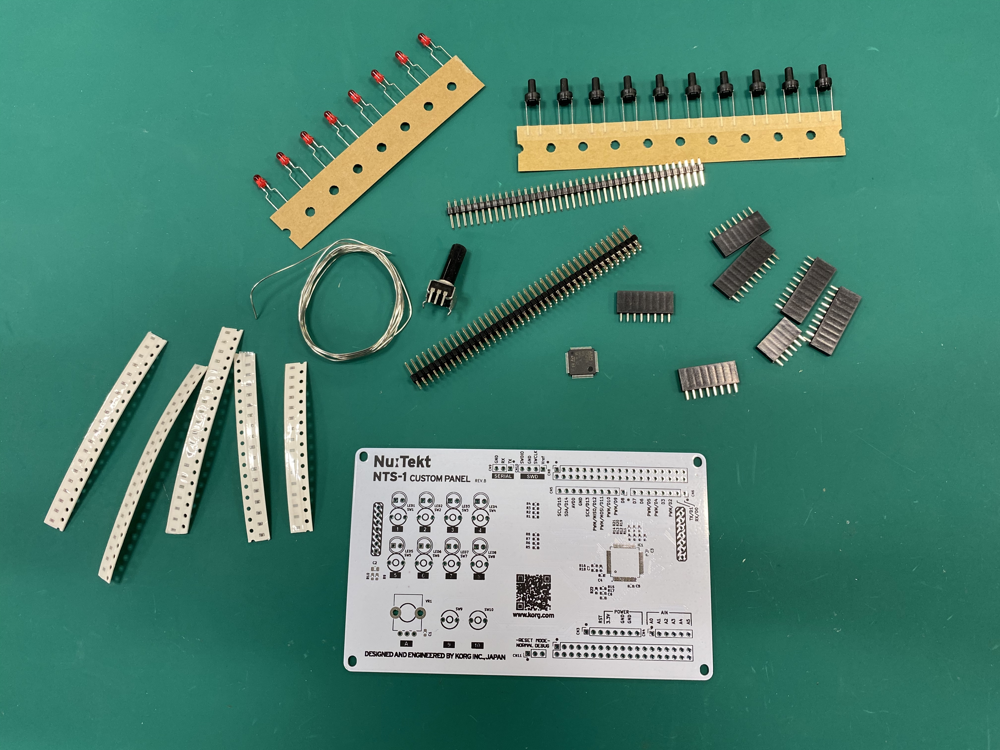

## Preparing the PCB

The NTS-1 Custom Panel reference board is open hardware and all source/description files are available [on GitHub](https://github.com/korginc/NTS-1-customizations/tree/master/Custom_Panel_RevB). 

The [PCB Gerber data](https://github.com/korginc/NTS-1-customizations/tree/master/Custom_Panel_RevB/Gerber) can be used as-is to order bare boards from a PCB manufacturing service near you. 

_add example list of pcb manufacturing services?_

The provided [KiCAD project](https://github.com/korginc/NTS-1-customizations/tree/master/Custom_Panel_RevB/KiCAD) can be used as a starting point to create your own custom panel designs.

## Acquiring Parts

The following parts are necessary to fully mount the reference board. 

Full bill of materials: [PDF](https://github.com/korginc/NTS-1-customizations/raw/master/Custom_Panel_RevB/BOM-mouser.pdf), [Excel](https://github.com/korginc/NTS-1-customizations/raw/master/Custom_Panel_RevB/BOM-mouser.xls)

_Tip: The Excel file can be uploaded directly to [Mouser](https://www.mounser.com) to automatically fill your cart with the appropriate parts._

| Manufacturer       | Description                                                           | Qty | Datasheet     |
|:------------------ |:--------------------------------------------------------------------- |:--------:|:------------- |
| Yageo              | Thick Film Resistors - SMD ZERO OHM JUMPER                            | 1   | [datasheet](https://www.mouser.com/datasheet/2/447/PYu-RC_Group_51_RoHS_L_10-1664068.pdf) |
| Yageo              | Thick Film Resistors - SMD 33 OHM 5%                                  | 1   | [datasheet](https://www.mouser.com/datasheet/2/447/PYu-RC_Group_51_RoHS_L_10-1664068.pdf) |
| Yageo              | Thick Film Resistors - SMD 47 OHM 5%                                  | 4   | [datasheet](https://www.mouser.com/datasheet/2/447/PYu-RC_Group_51_RoHS_L_10-1664068.pdf) |
| Yageo              | Thick Film Resistors - SMD 220 OHM 5%                                 | 8   | [datasheet](https://www.mouser.com/datasheet/2/447/PYu-RC_Group_51_RoHS_L_10-1664068.pdf) |
| Yageo              | Thick Film Resistors - SMD 100K OHM 5%                                | 1   | [datasheet](https://www.mouser.com/datasheet/2/447/PYu-RC_Group_51_RoHS_L_10-1664068.pdf) |
| Yageo              | Thick Film Resistors - SMD 10K OHM 5%                                 | 4   | [datasheet](https://www.mouser.com/datasheet/2/447/PYu-RC_Group_51_RoHS_L_10-1664068.pdf) |
| Yageo              | Thick Film Resistors - SMD 1K OHM 5%                                  | 2   | [datasheet](https://www.mouser.com/datasheet/2/447/PYu-RC_Group_51_RoHS_L_10-1664068.pdf) |
| Yageo              | Thick Film Resistors - SMD 47K OHM 5%                                 | 1   | [datasheet](https://www.mouser.com/datasheet/2/447/PYu-RC_Group_51_RoHS_L_10-1664068.pdf) |
| KEMET              | Multilayer Ceramic Capacitors - SMD 16V 0.1uF 0603 X7R 10%            | 4   | [datasheet](https://www.mouser.com/datasheet/2/212/KEM_C1090_X7R_ESD-1103328.pdf) |
| KEMET              | Multilayer Ceramic Capacitors - SMD 16V 1000pF 0603 X7R 10% AEC-Q200  | 2   | [datasheet](https://www.mouser.com/datasheet/2/212/KEM_C1090_X7R_ESD-1103328.pdf) |
| KEMET              | Multilayer Ceramic Capacitors - SMD 16V 10uF X5R 0805 10%             | 1   | [datasheet](https://www.mouser.com/datasheet/2/212/KEM_C1006_X5R_SMD-1103249.pdf) |
| TE Connectivity    | Headers & Wire Housings 38 MODII HDR DRST UNSHRD .100                 | 2   | [datasheet](https://www.mouser.com/datasheet/2/418/NG_CD_87215_J4-642383.pdf) |
| TE Connectivity    | Headers & Wire Housings 1X02P RCPT HV-100 TE                          | 1   | [datasheet](https://www.mouser.com/datasheet/2/418/NG_CD_215299_E-1247332.pdf) |
| TE Connectivity    | Headers & Wire Housings 6P RECPT VERT HV-100                          | 1   | [datasheet](https://www.mouser.com/datasheet/2/418/NG_CD_215299_E-1247285.pdf) |
| TE Connectivity    | Headers & Wire Housings 8P RECPT VERT HV-100                          | 2   | [datasheet](https://www.mouser.com/datasheet/2/418/NG_CD_215299_E-1247329.pdf) |
| TE Connectivity    | Headers & Wire Housings 1X03 POS VERT TIN                             | 2   | [datasheet](https://www.mouser.com/datasheet/2/418/NG_CD_826629_AC-1262378.pdf) |
| TE Connectivity    | Headers & Wire Housings 1X04 POS VERT TIN                             | 1   | [datasheet](https://www.mouser.com/datasheet/2/418/NG_CD_826629_AC-673695.pdf) |
| Omron              | Headers & Wire Housings Sensor I/O Connector                          | 2   | [datasheet](https://www.mouser.com/datasheet/2/307/en-xg8-1539045.pdf) |
| Kingbright         | Standard LEDs - Through Hole 5mm Red LED 640nm                        | 8   | [datasheet](https://www.mouser.com/datasheet/2/216/WP7113SRD-J4-1114353.pdf) |
| ALPS               | Potentiometers 10 KOhms 20%                                           | 1   | [datasheet](https://www.mouser.com/catalog/specsheets/alps_alps-s-a0003696969-1.pdf) |
| ALPS               | Tactile Switches RND 6.0x4.3mm 100gf                                  | 10  | [datasheet](https://www.mouser.com/catalog/specsheets/alps_alps-s-a0002902225-1.pdf) |
| STMicroelectronics | ARM Microcontrollers - MCU Value-Line ARM MCU 64kB 48 MHz             |  1  | [datasheet](https://www.mouser.com/datasheet/2/389/stm32f030f4-956260.pdf) |
| TE Connectivity    | Headers & Wire Housings 2 POS POST SHUNT                              | 1   | [datasheet](https://www.mouser.com/datasheet/2/418/NG_SS_108-37006_D-876462.pdf) |

## Soldering

Once all parts of the BOM have been acquired, refer to the [schematic](https://github.com/korginc/NTS-1-customizations/blob/master/Custom_Panel_RevB/schematic.pdf) and [mount diagram](https://github.com/korginc/NTS-1-customizations/blob/master/Custom_Panel_RevB/mount_diagram.pdf), and solder each part to its appropriate location on the PCB.

### Soldering Tutorials

There are many tutorials all over the internet, however not all of them cover surface mount devices which are required for the NTS-1 Custom Panel. The tutorial videos below do cover everything you need: 

EEVblog Soldering Tutorial:
* [EEVblog Soldering Tutorial Part 1: Tools](https://www.youtube.com/watch?v=J5Sb21qbpEQ)
* [EEVblog Soldering Tutorial Part 2: Through Hole](https://www.youtube.com/watch?v=fYz5nIHH0iY)
* [EEVblog Soldering Tutorial Part 3: Surface Mount](https://www.youtube.com/watch?v=fYz5nIHH0iY)

## Assembling

After completing the soldering, remove the interface panel of the NTS-1 digital kit and replace it with the custom panel.

_Note: NTS-1 main system has to be updated to at least version 1.10 in order to work with custom panels. Confirm the firmware version and update if needed before replacing the panel._

_Note: NTS-1 digital kit firmware version 1.10 will be released towards the end of January 2020._

