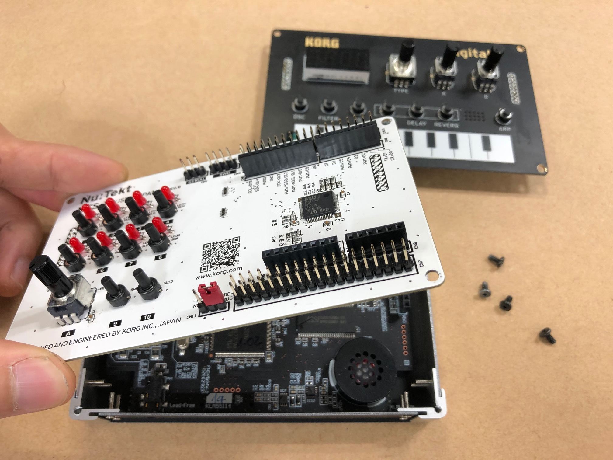

## Preparing the PCB

The NTS-1 custom panel reference board is available as open hardware schematics, CAD and PCB data. The raw PCB data can be used as-is to order bare boards from a PCB manufacturing service near you. KiCAD project files are also provided to simplify the creation of original NTS-1 custom panels.

The reference design includes a minimal user interface in the form of 10 switches, 8 LEDs and a rotary, and also has Arduino shield compatible expansion connectors and [STM32 Nucleo-style](https://www.st.com/en/evaluation-tools/stm32-nucleo-boards.html) expansion connectors to simplify prototyping. 

_add example list of pcb manufacturing services?_

## Acquiring Parts

_todo add links to BOM in github + link to mouser BOM_

## Soldering

Once all parts of the BOM have been acquired, refer to the [schematics]() and [placement diagram](), and solder each part its appropriate location on the PCB.

_add some links to SMD soldering tutorials?_

## Assembling

After completing the soldering, remove the interface panel of the NTS-1 digital kit and replace it with the custom panel.

_note: NTS-1 main system has to be updated to at least version 1.10 in order to work with custom panels. Confirm the firmware version and update if needed before replacing the panel._

_note: NTS-1 digital kit firmware version 1.10 will be released towards the end of January 2020._

<!-- ### Play and modify -->

<!-- Now the custom panel works as a unique instrument. The template board works as follows if you upload the demo 1. -->

<!-- * Switch 1-8: -->
<!--  enable or disable the note for the internal sequencer -->
<!-- * Switch 9: -->
<!--  Play/Stop for the internal sequencer -->
<!-- * Switch 10: -->
<!--  Shift function. -->
<!-- * VR A: -->
<!--  changes the shape parameter of internal synth(set as waves; template user oscillator). And it has multiple functions accompanies with other interfaces. -->
 
<!--  +Step1-8(Switch 1-8): change the pitch of each step -->
<!--  +Shift(Switch 10): change the tempo. -->

<!-- We development team tried to make some gears, as examples of use case of this custom panel format. Please refer to them and make your own instruments. -->

<!-- movie -->
