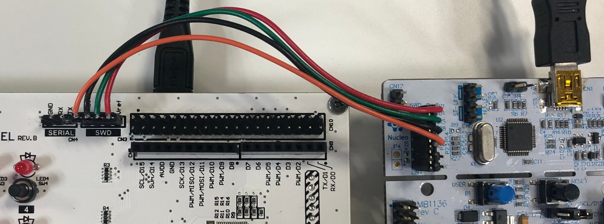
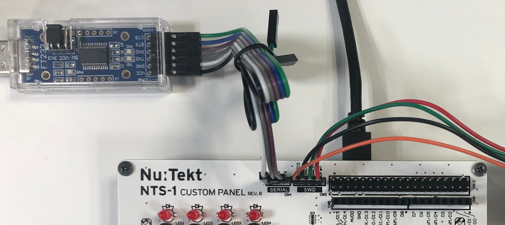

## Choosing a Board Programmer

The reference custom panel uses a [microcontroller (STM32F030R8)](https://www.st.com/en/microcontrollers-microprocessors/stm32f030r8.html) to scan for user interactions and communicate with the NTS-1 digital kit's main board. The most convenient way to program this microcontroller is via the exposed _SWD_ (4-pin) connector using an ST-LINK (or compatible) chip programmer, here are some examples:

* Nucleo board with built-in ST-LINK: [NUCLEO-F030R8](https://www.st.com/en/evaluation-tools/nucleo-f030r8.html)
* Standalone ST-LINK: [STLINK-V3SET](https://www.st.com/en/development-tools/stlink-v3set.html)
* OEM ST-LINK compatible USB dongles: i.e: [amazon](https://www.amazon.com/dp/B01J7N3RE6/ref=cm_sw_r_tw_dp_U_x_nkh.DbGGFNB6N) 

_Caution! Many OEM programmer dongles provide 3.3V on the Vref pin instead of monitoring it for reference voltage as they should, make sure NOT to connect the Vref pin of such programmers. Use a voltmeter to check the Vref pin of the programmer, if you detect a voltage on it do NOT connect it to the reference custom panel board. Official ST-LINK programmers do not have that problem._

Female-female DuPont pin cables with 2.54mm pitch will also be required to connect your programmer to the SWD pins of the reference board (sometimes provided with the programmer). Depending on the programmer you use the SWD pins of the reference board may not be in the same order, carefully read your programmer's manual and make sure you connect the pins in the right order. ([splitable or individual pin cables](https://www.amazon.com/40pcs-Female-2-54mm-Jumper-2x40pcs/dp/B00GSE2S98) may be useful if you need to reorder the connections)

## Connecting the Programmer

The ST-LINK compatible programmer should be connected to the _SWD_ connector in the following way:



### Preventing Panel Reset

While programming and generally during firmware development, it is recommended to prevent the reference custom panel from being reset by the NTS-1 digital kit's main board when communication timeouts occur.

To prevent panel resets, set the jumper on connector _CN11_ to the _DEBUG_ position.

The jumper can be placed back into the _NORMAL_ position when simply using the NTS-1 digital kit with the custom panel.

## Programming with the Arduino IDE

An Arduino board definition package is provided for the reference custom panel, which allows to build firmwares from Arduino Sketches and program the microcontroller via the [Arduino IDE](https://www.arduino.cc/en/Main/Software). The board definition handles the low level details of the communication with the NTS-1 digital kit's main board, providing a high level interface suitable for fast prototyping.

### Requirements

The following softwares must be installed:

* [Arduino IDE](https://www.arduino.cc/en/Main/Software)
* [STM32 Cube Programmer](https://www.st.com/en/development-tools/stm32cubeprog.html)

### Setting Up the Board Definition

1. In the Arduino IDE, open the _Preferences_ from the _File_ menu
2. Open the _Additional Boards Manager URLs_ editing window
3. Add the following two URLs to the list:

```
 https://raw.githubusercontent.com/stm32duino/BoardManagerFiles/master/STM32/package_stm_index.json
 <TBD>
```

4. Click OK for both windows, and open the _Boards Manager_ from the _Tools > Board:_ menu
5. Search for _STM32 Cores_ and install version _1.7.0_
6. Search for _NTS-1 Custom Panels_ and install version _1.0.0_
7. Select _NTS-1 Custom Panel rev.B_ from the _Tools > Board:_ menu in the _NTS-1 Custom Panels_ group

### Serial Monitoring

Monitoring via the built-in Arduino Serial object is possible by using a USB-Serial adapter (based on FTDI RS232 chip), such as [this one](https://www.mouser.jp/ProductDetail/FTDI/LC234X?qs=sGAEpiMZZMve4%2FbfQkoj%252BI%252BbU1q%2FCxfr%2FqVjw5o%252BdnQ%3D) or [this one](https://www.amazon.com/dp/B07TXVRQ7V/ref=cm_sw_r_tw_dp_U_x_2jh.DbQX9MS4Y).

_Caution! The NTS-1 Custom Panel Reference Board is not 5V tolerant. Please do NOT connect 5V powered device. USB serial adapters sometimes have jumpers to select 3.3V or 5V operation mode, make sure to set it to 3.3V._

Connect the USB-Serial adapter to the _SERIAL_ connector in the following way:



If using the Arduino IDE serial monitor, select the COM port corresponding to the USB-Serial adapter in the _tools > port_ menu. External serial monitoring software can also be used, in which case refer to that software's documentation.

### Example Sketches

Some examples Arduino Sketches are provided as starting points for your own projects:

* _Blank Template_: bare minimum code required to build a Sketch with the NTS-1 Custom Panel board definition.
* _Sequencer Template_: basic 8 step sequencer with user interface scanning and LED control implemented via timer driven interrupts

You can find the templates in the _NTS-1 Custom Panels_ group of the _File > Examples_ menu.

### Verify and Compile

You can compile your Sketch without uploading it to the board by pressing the _Verify_ button, or by selecting _Verify/Compile_ in the _Sketch_ menu.

Upon success you should see something like the output below in the Arduino IDE console.

```
 Sketch uses 10832 bytes (16%) of program storage space. Maximum is 65536 bytes.
 Global variables use 2112 bytes (25%) of dynamic memory, leaving 6080 bytes for local variables. Maximum is 8192 bytes.
```

### Uploading and Running

Once all prior steps have been completed. You can build and upload an Arduino Sketch to the reference custom panel board this way:

1. Make sure _Tools > Upload Method:_ is set to _SWD_.
2. Press the _Upload_ button, or select _Upload_ from the _Sketch_ menu.

Upon successful programming of the board you should see something like the output below in the Arduino IDE console:

 ```
      -------------------------------------------------------------------
                       STM32CubeProgrammer v2.2.0                  
      -------------------------------------------------------------------

    ST-LINK SN  : 066AFF535550755187255039
    ST-LINK FW  : V2J34M25
    Voltage     : 3.27V
    SWD freq    : 4000 KHz
    Connect mode: Under Reset
    Reset mode  : Hardware reset
    Device ID   : 0x440
    Device name : STM32F05x/F030x8
    Flash size  : 64 KBytes
    Device type : MCU
    Device CPU  : Cortex-M0

    Memory Programming ...
    Opening and parsing file: Blank_Template.ino.bin
        File          : Blank_Template.ino.bin
        Size          : 11056 Bytes
        Address       : 0x08000000 

    Erasing memory corresponding to segment 0:
    Erasing internal memory sectors [0 10]
    Download in Progress:
  
    File download complete
    Time elapsed during download operation: 00:00:00.982
    
    RUNNING Program ... 
        Address:      : 0x8000000
    Application is running
    Start operation achieved successfully
 ```

## Other Programming Methods

It is possible to program the reference custom panel directly using the [STM32 Cube Programmer](https://www.st.com/en/development-tools/stm32cubeprog.html) software from STMicro, or any other compatible programming/on-chip debugger software (i.e.: [OpenOCD](http://openocd.org/)), however it will be necessary to install toolchains on your own and build the firmware from scratch. 

Low level information about the communication protocol with the main board will be provided at a later date. 
