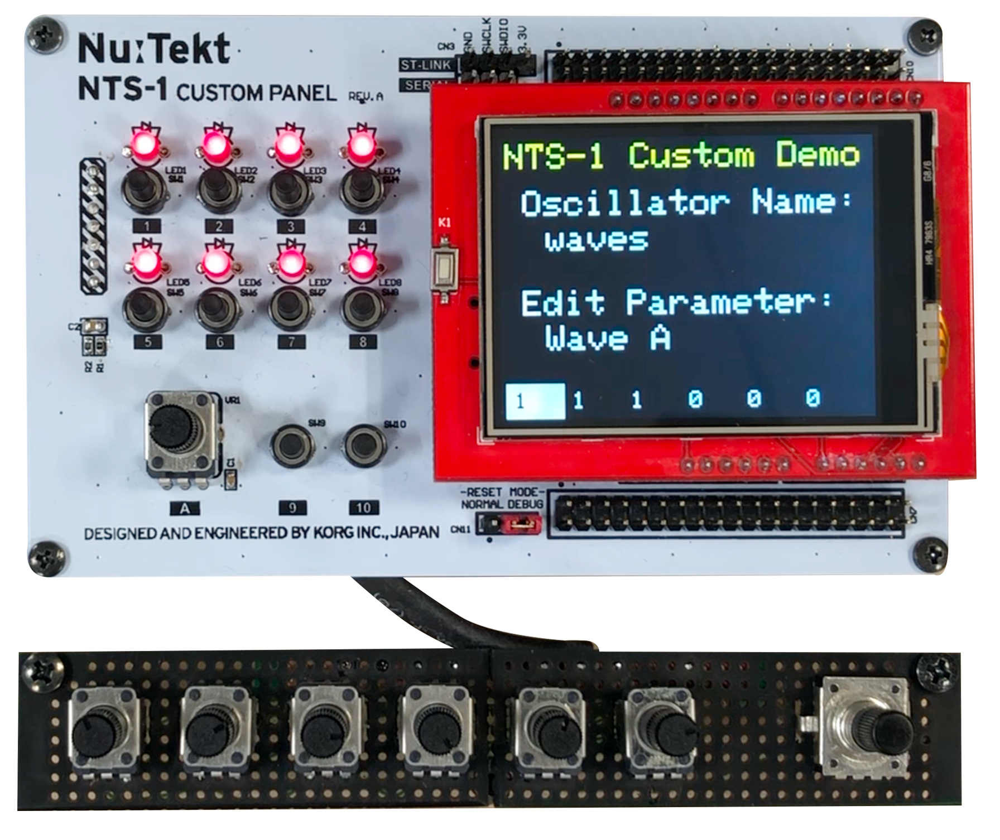
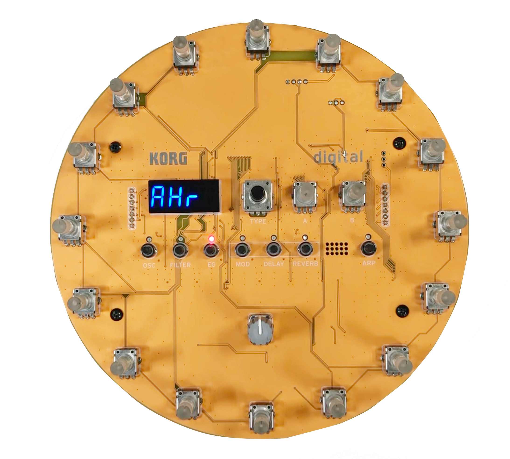
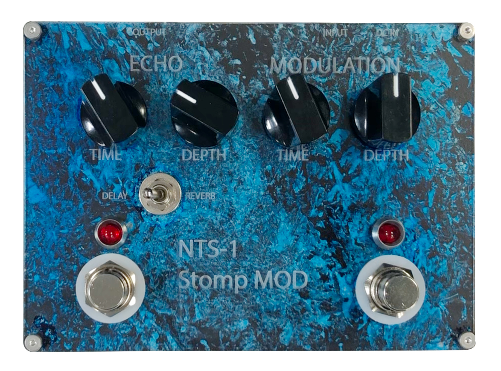

## Arduino Sketch Examples

Arduino Sketch examples can be found in the _File > Examples > NTS-1_ menu, or obtained from the [GitHub repository](https://github.com/korginc/nts-1-customizations/tree/master/Custom_Panel_RevC/Arduino/library/NTS-1).

### Blank Template

This template contains the bare minimum required to build a project for the NTS-1 Custom Panel reference board:

 ```
 #include <nts1.h>

 NTS1 nts1;

 void setup() {
   nts1.init(); // Performs hardware and peripheral initialization
   
   // Insert your setup code here
 }

 void loop() {
   nts1.idle(); // Runs internal processing of tx/rx communication with the main board
   
   // Insert your loop code here
 }
 ```
 
[See code on GitHub](https://github.com/korginc/nts-1-customizations/blob/master/Custom_Panel_RevC/Arduino/libraries/NTS-1/examples/Blank_Template/Blank_Template.ino).

### Sequencer Template

This template demonstrates how to use the NTS1 Class to trigger note on/off events and set parameters on the NTS-1 digital kit main board. It also demonstrates how to configure hardware timers to generate interrupts to drive time sensitive operations like switch/rotary scanning and sequencer ticks.

* LEDs 1 to 8 are used to display the on/off state of each 8 step of the sequence
* Pressing switches 1 to 8 while holding down switch 10 toggles the on/off state of that step in the sequence
* Rotary 1/A allows to change the oscillator SHAPE parameter
* Turning rotary 1/A while holding down switches 1 to 8 changes the pitch for those steps
* Turning rotary 1/A while holding switch 10 changes the sequencer's tempo
* Switch 9 start and stops the sequencer

[See code on GitHub](https://github.com/korginc/nts-1-customizations/blob/master/Custom_Panel_RevC/Arduino/libraries/NTS-1/examples/Sequencer_Template/Sequencer_Template.ino).

## Demo Boards

To illustrate the possibilities of NTS-1 custom panels we built the following demos.

### User Oscillator Editor

* Arduino compatible shield with 2.4 inch TFT display
* Dedicated control interface for user oscillators with 6 knobs and 1 encoder
* Based on [Sequencer Template](#sequencer-template) Arduino Sketch



### Circular Sequencer

* 16 Step Sequencer
* Dedicated control for pitch on each step
* Speed / direction control via central knob



### Effect Pedal

* Stomp box shaped design
* Dedicated reverb / delay controls
* Dedicated modulation effects controls
* 6.3 mm in/out jacks
* Arduino based firmware


