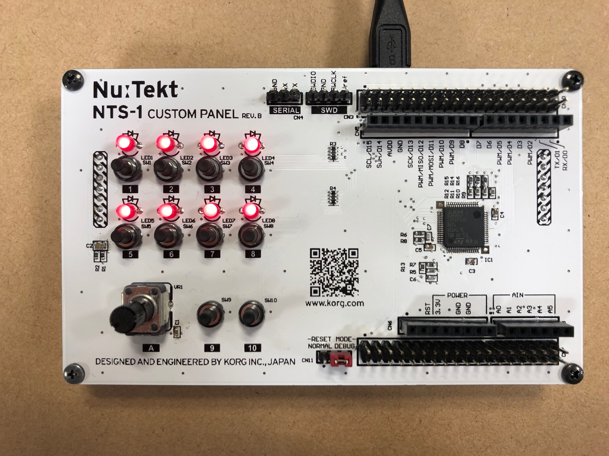

---
# To modify the layout, see https://jekyllrb.com/docs/themes/#overriding-theme-defaults

layout: home_ja
permalink: /ja/
---

The appearance and user interface of the [Nu:Tekt NTS-1 digital kit](https://www.korg.com/products/synthesizers/nts_1) synthesizer can be customized by replacing the front panel with a custom created one. This site provides the base material and guidance for the creation of such custom panels.

_Note: Custom panels are supported by the NTS-1 digital kit firmware version 1.10 and newer_

_Note: Firmware version 1.10 will be released late January 2020_

## Reference Custom Panel Design

We provide an open hardware reference panel design that can be used as a template for the creation of original NTS-1 panel designs.

## Getting Started

 1. [Assembly](doc/assembly/)
    1. [Preparing the PCB](doc/assembly/#preparing-the-pcb)
    2. [Acquiring parts](doc/assembly/#acquiring-parts)
    3. [Soldering](doc/assembly/#soldering)
    4. [Assembling](doc/assembly/#assembling)
 2. [Programming](doc/programming/)
    1. [Choosing a board programmer](doc/programming/#choosing-a-board-programmer)
    2. [Connecting the programmer](doc/programming/#connecting-the-programmer)
    3. [Programming with the Arduino IDE](doc/programming/#programming-with-the-arduino-ide)
 3. [Examples](doc/examples/)
    1. [Blank Template](doc/examples/#blank-template): Bare minimum code required to build an arduino Sketch
    2. [Sequencer Template](doc/examples/#sequencer-template): Basic 8 step sequencer with minimal user interface
    3. [Demo Boards](doc/examples/#demo-boards): Demo custom panel boards made for NAMM 2020

_Tip: Try out the Sequencer Template example first. Find usage instructions [here](doc/examples/#sequencer-template)_

<!-- Schematics, bill of materials, CAD and PCB data for the reference design are available [here](https://github.com/korginc/NTS-1-customizations/tree/master/CustomPanel_RevB) -->

<!-- The reference panel design is compatible with the [Arduino IDE](https://www.arduino.cc/en/Main/Software) via a dedicated board definition package. See [Programming](doc/programming/) for details. -->
